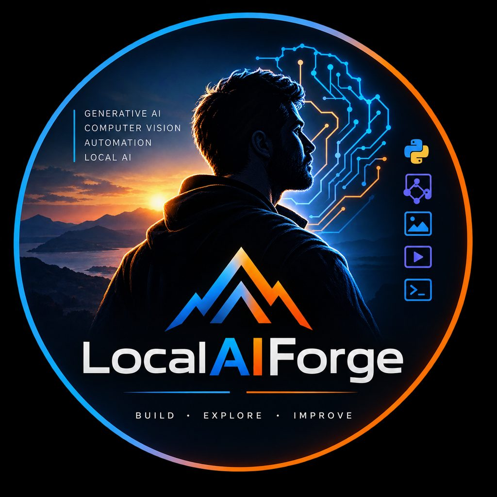

<p align="center">
  
</p>

# Hi, I'm Salvatore 👋

### AI & Generative AI developer focused on local LLMs, computer vision, automation, and efficient AI workflows.

`AI • Generative AI • Computer Vision • Local AI Systems | Italy`


I build and experiment with **local AI systems**, generative workflows, computer vision pipelines and automation tools, with a strong focus on running models efficiently on consumer hardware.

My main interests include:

* **Generative AI** — image and video generation, prompt engineering and workflow design
* **Local LLMs & Vision Models** — Ollama, multimodal models and AI-assisted pipelines
* **Computer Vision** — image analysis, restoration, enhancement and product-focused workflows
* **AI Automation** — autonomous workflows, agents and task-oriented systems
* **Python Development** — tools, automation scripts and local AI applications
* **ComfyUI** — custom workflows, model integration and VRAM-efficient pipelines
* **AMD / ROCm** — experimenting with local AI acceleration and resource optimization

I am particularly interested in making AI systems **practical, reproducible and efficient**, especially when working within real hardware and memory constraints.

> Build locally. Understand the stack. Measure the limits. Improve the workflow.

## 🔹 Current Focus

* Local AI applications
* Generative image and video workflows
* Vision-language models
* AI automation and agents
* Efficient inference on consumer GPUs
* Product image processing and content generation
* Experimental AI tooling and workflow engineering

## 🛠️ Technologies

```text
Python / Ollama / ComfyUI / PyTorch / ROCm-HIP
LLMs / Vision-Language Models / Computer Vision
Generative AI / AI Agents / Git-GitHub / Linux
```

## 📌 Projects

> Work in progress — repos being published. Pinned repos below will appear here.

| Project | What | Stack |
|---|---|---|
| 🧠 Local AI Systems | Experiments and tools for running LLMs, vision models and generative AI locally, with emphasis on efficient resource usage | Ollama, Python, VLMs |
| 🎨 Generative AI Workflows | Custom ComfyUI workflows for image generation, enhancement, restoration and controlled manipulation | ComfyUI, Generative AI |
| 👁️ Computer Vision & Product AI | Workflows to analyse, enhance and transform product imagery while preserving visual characteristics | Computer Vision, Python |
| 🤖 AI Automation | Python-based tools and agent workflows connecting models, automation and real-world tasks | Python, Agents |

## 📊 GitHub Stats


## 📫 Contacts

* Location: Italy
* LinkedIn: _coming soon_
* Email: _coming soon_

---

<details>
<summary>🇮🇹 Versione italiana (clicca per espandere)</summary>

<br>

Sono Salvatore, sperimento con **AI locale, generazione immagini/video, computer vision e automazione**, con focus su efficienza su hardware consumer.

**Interessi principali:** Generative AI, LLM locali e modelli vision con Ollama, computer vision per analisi/restauro/enhancement immagini, automazione e agenti AI, sviluppo Python, workflow ComfyUI VRAM-efficienti, accelerazione AMD/ROCm.

**Focus attuale:** applicazioni AI locali, workflow generativi, vision-language models, automazione e agenti, inferenza efficiente su GPU consumer, product image processing.

> Costruire in locale. Capire lo stack. Misurare i limiti. Migliorare il workflow.

</details>
